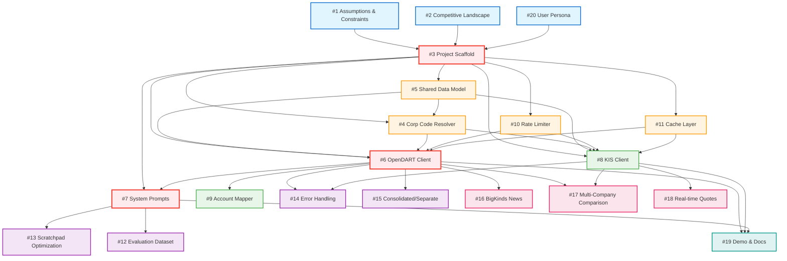

# Korean Dexter - Dependency Graph

Visual dependency graph of all 20 GitHub issues showing implementation order and critical path.

## Issue Summary

| Issue # | Title | Phase | Blocks |
|---------|-------|-------|--------|
| #1 | Document Assumptions & Constraints | Planning | #3 |
| #2 | Research Competitive Landscape | Planning | #3 |
| #3 | Project Scaffold & Core Infrastructure | Foundation | #4, #5, #6, #7, #8, #10, #11 |
| #4 | Corp Code Resolver | Foundation | #6, #8 |
| #5 | Shared Data Model (Types) | Foundation | #4, #6, #8 |
| #6 | OpenDART Client & Tools | Core | #9, #15, #7 |
| #7 | System Prompts & Agent Configuration | Core | #13 |
| #8 | KIS API Client & Tools | Core | - |
| #9 | Account Mapper | Core | - |
| #10 | Rate Limiter | Infrastructure | #6, #8 |
| #11 | Cache Layer | Infrastructure | #6, #8 |
| #12 | Evaluation Dataset & Runner | Testing | - |
| #13 | Scratchpad Optimization | Optimization | - |
| #14 | Error Handling & Resilience | Optimization | - |
| #15 | Consolidated vs Separate Statements | Enhancement | - |
| #16 | BigKinds Integration (News) | v1.1 | - |
| #17 | Multi-Company Comparison | v1.1 | - |
| #18 | Real-time Quote Streaming | v1.1 | - |
| #19 | Demo Video & Documentation | Documentation | working agent |
| #20 | Define User Persona & Use Cases | Planning | #3 |

## Dependency Graph (Mermaid)



## Critical Path

The critical path for MVP (minimum viable product) is:

```
#1 → #3 → #5 → #4 → #6 → #7 → #12
```

**Estimated Timeline**: 5 weeks
- Week 1: #1, #2, #20, #3 (planning + scaffold)
- Week 2: #5, #4, #10, #11 (foundation + infra)
- Week 3: #6, #8 (data sources)
- Week 4: #7, #9, #15 (prompts + mapping)
- Week 5: #12, #13, #14 (eval + optimization)

**Parallel Tracks**:
- OpenDART track: #3 → #5 → #4 → #10 → #11 → #6 → #9 → #15
- KIS track: #3 → #5 → #4 → #10 → #11 → #8
- Prompts track: #6 → #7 → #12 → #13
- Error handling: #6 + #8 → #14

## Phase Breakdown

### Phase 0: Planning (Week 1)

**Objective**: Define scope, constraints, and competitive position

**Issues**: #1, #2, #20

**Deliverables**:
- Assumptions documented (API limitations, Korean market specifics)
- Competitive analysis (vs existing Korean financial tools)
- User personas (retail investors, analysts, researchers)

**Blockers**: None (can start immediately)

**Parallel work**: All 3 issues can run concurrently

### Phase 1: Foundation (Week 1-2)

**Objective**: Set up project structure and core types

**Issues**: #3, #5, #4, #10, #11

**Deliverables**:
- Project scaffold (Bun + TypeScript + directory structure)
- Type system (ResolvedCompany, NormalizedAmount, PeriodRange)
- Corp code resolver (name/ticker → corp_code)
- Rate limiter (per-API quota enforcement)
- Cache layer (permanent for historical data)

**Dependencies**:
- #3 depends on: #1, #2, #20 (planning complete)
- #5 depends on: #3 (project scaffold exists)
- #4 depends on: #3, #5 (types defined)
- #10, #11 depend on: #3 (project scaffold exists)

**Critical path**: #1 → #3 → #5 → #4

**Parallel work**: After #3 completes, can run #4, #5, #10, #11 concurrently

### Phase 2: Core Data Sources (Week 3)

**Objective**: Implement OpenDART and KIS API clients + tools

**Issues**: #6, #8

**Deliverables**:
- OpenDART client (financials, disclosures, shareholding)
- OpenDART tools (get_income_statements, get_disclosure_list, etc.)
- KIS client (stock prices, volumes, investor flows)
- KIS tools (get_stock_prices, get_investor_flows, etc.)

**Dependencies**:
- #6 depends on: #3, #4, #5, #10, #11 (all foundation complete)
- #8 depends on: #3, #4, #5, #10, #11 (same as #6)

**Critical path**: #5 → #4 → #6 (OpenDART is more critical than KIS for financials)

**Parallel work**: #6 and #8 can run concurrently (separate APIs)

### Phase 3: Agent Configuration (Week 4)

**Objective**: Prompts, account mapping, statement selection

**Issues**: #7, #9, #15

**Deliverables**:
- System prompts (Korean financial analyst persona)
- Meta-tool routing prompts
- Account mapper (Korean account names → concepts)
- Consolidated vs separate statement logic

**Dependencies**:
- #7 depends on: #6, #8 (tools exist to prompt for)
- #9 depends on: #6 (OpenDART data to map)
- #15 depends on: #6 (OpenDART financials)

**Critical path**: #6 → #7

**Parallel work**: #9 and #15 can run with #7 (independent tasks)

### Phase 4: Testing & Optimization (Week 5)

**Objective**: Evaluation, performance tuning, error handling

**Issues**: #12, #13, #14

**Deliverables**:
- Korean eval dataset (100 queries with ground truth)
- Eval runner adapted for Korean metrics
- Scratchpad token budget optimization
- Error handling (retry logic, fallbacks, user-friendly errors)

**Dependencies**:
- #12 depends on: #7 (working agent to evaluate)
- #13 depends on: #7 (prompts to profile for token usage)
- #14 depends on: #6, #8 (API clients to add error handling to)

**Critical path**: #7 → #12

**Parallel work**: #13 and #14 can run with #12

### Phase 5: v1.1 Features (Post-MVP)

**Objective**: Enhanced data sources and capabilities

**Issues**: #16, #17, #18

**Deliverables**:
- BigKinds integration (Korean news articles)
- Multi-company comparison tools
- Real-time quote streaming (KIS websocket)

**Dependencies**:
- #16 depends on: #6 (working agent to add news to)
- #17 depends on: #6, #8 (multiple data fetches to orchestrate)
- #18 depends on: #8 (KIS client to add streaming to)

**Not on critical path**: Deferred to v1.1

### Phase 6: Documentation (Week 6)

**Objective**: Demo and user-facing docs

**Issue**: #19

**Deliverables**:
- Demo video (3 example queries with Korean output)
- README with Korean examples
- API documentation

**Dependencies**: #19 depends on working agent (#6, #7, #8)

## Bottleneck Analysis

### Single-Point Bottlenecks

**#3 (Project Scaffold)**: Blocks 7 issues (#4, #5, #6, #7, #8, #10, #11)
- **Risk**: Any delay here cascades to entire project
- **Mitigation**: Prioritize #3 above all else, use upstream Dexter structure as template

**#6 (OpenDART Client)**: Blocks 4 issues (#9, #15, #7, #14)
- **Risk**: Most complex API integration (300+ account types, CFS/OFS logic)
- **Mitigation**: Implement incrementally (financials first, then disclosures/shareholding)

**#7 (System Prompts)**: Blocks 2 issues (#12, #13) and is critical for agent to function
- **Risk**: Prompt engineering is iterative, hard to estimate
- **Mitigation**: Start with minimal prompt, iterate based on eval results

### Resource Constraints

**API Rate Limits**:
- OpenDART: 10k requests/day (shared across team)
- KIS: 1 req/sec (strict)

**Impact**: Testing and eval may hit limits
**Mitigation**: #10 (rate limiter) and #11 (cache) reduce API usage

### Parallelization Opportunities

**Week 2**: After #3 completes, run 4 parallel tracks:
1. #5 (types) → critical path
2. #4 (corp resolver) → critical path after #5
3. #10 (rate limiter) → infrastructure
4. #11 (cache) → infrastructure

**Week 3**: After foundation, run 2 parallel tracks:
1. #6 (OpenDART) → critical path
2. #8 (KIS) → parallel data source

**Week 5**: After prompts, run 3 parallel tracks:
1. #12 (eval) → critical path
2. #13 (scratchpad) → optimization
3. #14 (error handling) → resilience

## Issue Details

### #1: Document Assumptions & Constraints

**Phase**: Planning
**Effort**: 1 day
**Depends on**: None
**Blocks**: #3

**Key Assumptions to Document**:
- OpenDART data lag (T+1 for disclosures, T+90 for audited financials)
- KIS API quota (1 req/sec, real-time only during market hours)
- LLM token costs (Claude vs GPT-4 for Korean)
- Korean text verbosity (2-3x English token usage)
- Consolidated vs separate default (prefer CFS, fall back to OFS)

### #2: Research Competitive Landscape

**Phase**: Planning
**Effort**: 2 days
**Depends on**: None
**Blocks**: #3

**Competitors to Analyze**:
- FnGuide (professional, paid)
- Investing.com Korea (retail, limited)
- NaverFinance (data only, no analysis)
- Existing LLM agents (GPT-4 with web search)

**Differentiation**: Agentic reasoning + multi-source data + Korean financial literacy

### #3: Project Scaffold & Core Infrastructure

**Phase**: Foundation
**Effort**: 2 days
**Depends on**: #1, #2, #20
**Blocks**: #4, #5, #6, #7, #8, #10, #11

**Deliverables**:
- Bun project setup (package.json, tsconfig.json)
- Directory structure (src/, tests/, .dexter/)
- Upstream Dexter fork (keep agent.ts, scratchpad.ts, types.ts)
- CLI entry point (placeholder)
- Test framework (Bun test)

**See**: [[../implementation/project-structure|Project Structure]]

### #4: Corp Code Resolver

**Phase**: Foundation
**Effort**: 3 days
**Depends on**: #3, #5
**Blocks**: #6, #8

**Deliverables**:
- `resolveCompany(query)` function
- Exact match (ticker, corp_code, name)
- Fuzzy match (jamo-aware Levenshtein)
- Corp list loader (daily update from OpenDART)

**See**: [[../implementation/corp-code-resolver|Corp Code Resolver]]

### #5: Shared Data Model (Types)

**Phase**: Foundation
**Effort**: 2 days
**Depends on**: #3
**Blocks**: #4, #6, #8

**Deliverables**:
- ResolvedCompany interface
- NormalizedAmount type
- PeriodRange type
- KoreanToolResult type

**See**: [[type-system|Type System]]

### #6: OpenDART Client & Tools

**Phase**: Core
**Effort**: 5 days
**Depends on**: #3, #4, #5, #10, #11
**Blocks**: #9, #15, #7

**Deliverables**:
- OpenDART API client (http wrapper)
- 8 tools: financials (income, balance, cashflow), disclosures, shareholding, exec comp
- Rate limiting integration
- Caching integration

**See**: [[../implementation/opendart-client|OpenDART Client]]

### #7: System Prompts & Agent Configuration

**Phase**: Core
**Effort**: 4 days
**Depends on**: #6, #8
**Blocks**: #13

**Deliverables**:
- System prompt (Korean financial analyst persona)
- Meta-tool routing prompts
- Tool descriptions (Korean context)
- Agent config defaults (iterations, token budget)

**See**: [[../implementation/prompt-design|Prompt Design]]

### #8: KIS API Client & Tools

**Phase**: Core
**Effort**: 4 days
**Depends on**: #3, #4, #5, #10, #11
**Blocks**: None (parallel with #6)

**Deliverables**:
- KIS OAuth manager (token refresh)
- 5 tools: stock prices, volumes, investor flows, market data, quotes
- Rate limiting (1 req/sec)
- Caching (permanent for historical)

**See**: [[../implementation/kis-client|KIS Client]]

### #9: Account Mapper

**Phase**: Core
**Effort**: 3 days
**Depends on**: #6
**Blocks**: None

**Deliverables**:
- Account mapping JSON (300+ entries)
- Mapper functions (Korean name → concept ID)
- Reverse lookup (concept ID → Korean names)

**See**: [[../implementation/account-mapper|Account Mapper]]

### #10: Rate Limiter

**Phase**: Infrastructure
**Effort**: 2 days
**Depends on**: #3
**Blocks**: #6, #8

**Deliverables**:
- Sliding window rate limiter
- Per-API quota config
- Backoff on 429 errors
- Persistent state (survive restart)

**See**: [[../implementation/rate-limiter|Rate Limiter]]

### #11: Cache Layer

**Phase**: Infrastructure
**Effort**: 2 days
**Depends on**: #3
**Blocks**: #6, #8

**Deliverables**:
- File-based cache (default)
- TTL support (permanent for historical)
- Cache key generator (source + endpoint + params)
- Cache invalidation (manual trigger)

**See**: [[../implementation/cache-layer|Cache Layer]]

### #12: Evaluation Dataset & Runner

**Phase**: Testing
**Effort**: 3 days
**Depends on**: #7
**Blocks**: None

**Deliverables**:
- 100 Korean eval queries
- Ground truth (from OpenDART/KIS)
- Korean-specific metrics (amount formatting, account mapping)
- Eval runner (adapted from Dexter)

**See**: [[../evaluation/eval-dataset|Eval Dataset]]

### #13: Scratchpad Optimization

**Phase**: Optimization
**Effort**: 2 days
**Depends on**: #7
**Blocks**: None

**Deliverables**:
- Token budget tuning (Korean verbosity)
- Context clearing heuristics
- Relevance scoring (keep high-value results)

**See**: [[../optimization/scratchpad-tuning|Scratchpad Tuning]]

### #14: Error Handling & Resilience

**Phase**: Optimization
**Effort**: 3 days
**Depends on**: #6, #8
**Blocks**: None

**Deliverables**:
- Retry logic (exponential backoff)
- Fallback strategies (CFS → OFS, OpenDART → KIS)
- User-friendly error messages (Korean)
- API health checks

**See**: [[../implementation/error-handling|Error Handling]]

### #15: Consolidated vs Separate Statements

**Phase**: Enhancement
**Effort**: 2 days
**Depends on**: #6
**Blocks**: None

**Deliverables**:
- CFS/OFS detection logic
- Automatic fallback (prefer CFS, use OFS if unavailable)
- User override (force CFS or OFS)

**See**: [[../implementation/consolidated-separate|Consolidated vs Separate]]

### #16-18: v1.1 Features (Deferred)

**Not on critical path for MVP**

### #19: Demo Video & Documentation

**Phase**: Documentation
**Effort**: 2 days
**Depends on**: working agent (#6, #7, #8)
**Blocks**: None

**Deliverables**:
- 3-minute demo video (Korean voiceover)
- README with Korean examples
- API documentation

### #20: Define User Persona & Use Cases

**Phase**: Planning
**Effort**: 1 day
**Depends on**: None
**Blocks**: #3

**Personas**:
- Retail investor (casual queries, trend analysis)
- Financial analyst (deep-dive comparisons, ratio analysis)
- Academic researcher (historical data, statistical patterns)

## Cross-References

- [[overview|Architecture Overview]] - System design
- [[type-system|Type System]] - Interface definitions
- [[dexter-mapping|Dexter Mapping]] - Component mapping
- [[../implementation/project-structure|Project Structure]] - Directory layout
- [[../implementation/corp-code-resolver|Corp Code Resolver]] - #4 implementation
- [[../implementation/opendart-client|OpenDART Client]] - #6 implementation
- [[../implementation/kis-client|KIS Client]] - #8 implementation
- [[../evaluation/eval-dataset|Eval Dataset]] - #12 implementation
